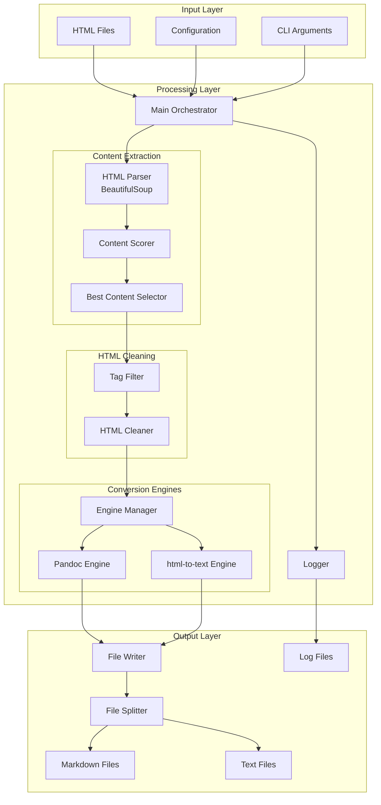
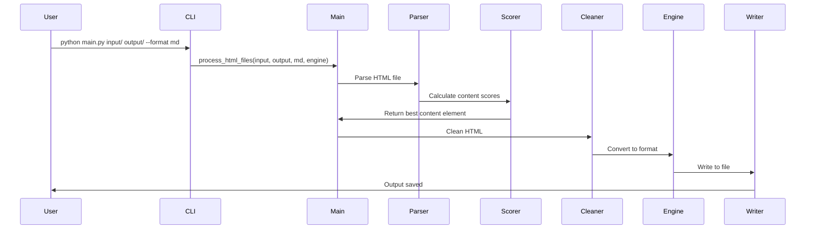
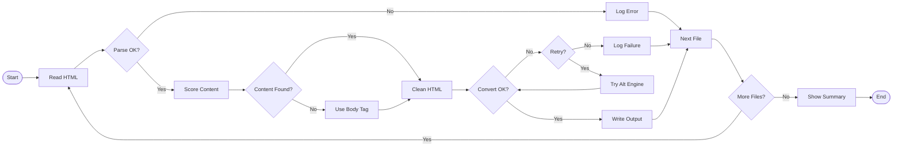

# System Architecture


## Table of Contents

- [System Overview](#system-overview)
- [Architecture Diagram](#architecture-diagram)
- [Component Design](#component-design)
- [Data Flow](#data-flow)
- [Design Decisions](#design-decisions)
- [Processing Pipeline](#processing-pipeline)
- [Engine Architecture](#engine-architecture)
- [Error Handling](#error-handling)
- [Extension Points](#extension-points)
- [Security Considerations](#security-considerations)
- [Performance Architecture](#performance-architecture)
- [Future Architecture](#future-architecture)

## System Overview

The HTML Converter implements a modular, pipeline-based architecture optimized for batch processing HTML documents into clean Markdown or plain text formats. The system features a dual-engine design allowing users to choose between speed (html-to-text) and accuracy (Pandoc).

### Key Architectural Principles

1. **Separation of Concerns**: Each component has a single, well-defined responsibility
2. **Pluggable Engines**: Conversion engines are interchangeable through a common interface
3. **Pipeline Processing**: Data flows through distinct transformation stages
4. **Graceful Degradation**: System continues operation despite individual file failures
5. **Resource Management**: Automatic file splitting and memory management

### High-Level Components

```
┌─────────────────────────────────────────────────┐
│                  CLI Interface                   │
│              (Argument Parsing)                  │
└────────────────────┬───────────────────────────┘
                     │
┌────────────────────▼───────────────────────────┐
│              Main Orchestrator                  │
│         (process_html_files)                    │
└────────────────────┬───────────────────────────┘
                     │
        ┌────────────┼────────────┐
        │            │            │
┌───────▼────┐ ┌────▼────┐ ┌────▼────┐
│  Content   │ │  HTML   │ │ Engine  │
│ Extraction │ │ Cleaning│ │ Manager │
└────────────┘ └─────────┘ └─────────┘
```

## Architecture Diagram

### Complete System Architecture



### Component Interaction Diagram

```
┌─────────────┐       ┌──────────────┐       ┌───────────────┐
│   User      │──────▶│     CLI      │──────▶│     Main      │
└─────────────┘       └──────────────┘       └───────┬───────┘
                                                      │
                                              ┌───────▼───────┐
                                              │   File I/O    │
                                              └───────┬───────┘
                                                      │
                      ┌───────────────────────────────┼───────────────────────────────┐
                      │                               │                               │
              ┌───────▼───────┐             ┌────────▼────────┐            ┌─────────▼─────────┐
              │  HTML Parser  │             │ Content Scorer  │            │   HTML Cleaner    │
              │ (BeautifulSoup)│            │  (Heuristics)   │            │  (Tag Filtering)  │
              └───────┬───────┘             └────────┬────────┘            └─────────┬─────────┘
                      │                               │                               │
                      └───────────────┬───────────────┘                               │
                                      │                                               │
                              ┌───────▼───────┐                              ┌────────▼────────┐
                              │Content Extract│                              │  Engine Router  │
                              └───────┬───────┘                              └────────┬────────┘
                                      │                                               │
                                      └───────────────┬───────────────────────────────┘
                                                      │
                                    ┌─────────────────┼─────────────────┐
                                    │                 │                 │
                            ┌───────▼───────┐ ┌──────▼──────┐ ┌────────▼────────┐
                            │    Pandoc     │ │ html-to-text│ │ Custom Engine   │
                            │   (Binary)    │ │  (Node.js)  │ │   (Future)      │
                            └───────┬───────┘ └──────┬──────┘ └────────┬────────┘
                                    │                 │                 │
                                    └─────────────────┼─────────────────┘
                                                      │
                                              ┌───────▼───────┐
                                              │ Output Writer │
                                              └───────────────┘
```

## Component Design

### 1. CLI Interface Layer

**Purpose**: Parse and validate command-line arguments

**Components**:
- `argparse.ArgumentParser`: Command-line parsing
- Argument validation
- Help text generation

**Responsibilities**:
- Parse input/output directories
- Validate format choices (md/txt)
- Validate engine choices (pandoc/html-to-text)
- Display version information

### 2. Main Orchestrator

**Purpose**: Coordinate the entire conversion process

**Component**: `process_html_files()`

**Responsibilities**:
- Initialize logging
- Scan for HTML files
- Coordinate processing pipeline
- Track job statistics
- Handle errors gracefully
- Generate summary reports

**Design Pattern**: Facade Pattern
```python
def process_html_files(input_dir, output_dir, format, engine):
    # Facade for complex subsystem
    setup_logging(output_dir, input_folder_name)
    check_dependencies(engine)
    all_files = scan_html_files(input_dir)

    for file in all_files:
        html = read_file(file)
        content = extract_content(html)
        cleaned = clean_html(content)
        output = convert(cleaned, format, engine)
        write_output(output, output_dir)
```

### 3. Content Extraction Module

**Purpose**: Identify and extract main content from HTML

**Components**:
- `get_content_score()`: Scoring algorithm
- Content selection logic
- Fallback mechanisms

**Algorithm**:
```python
# Content Scoring Heuristic
score = 0
score += text_length * 1
score += paragraph_count * 25
score += is_article_tag * 200
score -= high_link_density * 100
score -= has_nav_indicators * 50
score += has_content_indicators * 50
```

**Design Decisions**:
- Heuristic-based vs. ML-based (chose heuristic for simplicity)
- Scoring weights based on empirical testing
- Fallback to `<body>` when no good content found

### 4. HTML Cleaning Module

**Purpose**: Remove noise while preserving semantic structure

**Component**: `clean_html_for_llm()`

**Strategy**:
- Whitelist approach (only keep allowed tags)
- Preserve semantic HTML tags
- Remove presentation tags
- Unwrap unnecessary containers

**Allowed Tags**:
```python
ALLOWED_TAGS = [
    # Structure
    'p', 'h1', 'h2', 'h3', 'h4', 'h5', 'h6',
    # Lists
    'ul', 'ol', 'li',
    # Semantic
    'blockquote', 'pre', 'code',
    # Tables
    'table', 'tr', 'td', 'th',
    # Inline
    'strong', 'em', 'a'
]
```

### 5. Engine Manager

**Purpose**: Route conversion to appropriate engine

**Component**: `convert_html_to_output()`

**Design Pattern**: Strategy Pattern
```python
def convert_html_to_output(html, format, engine):
    strategies = {
        'pandoc': convert_html_to_output_pandoc,
        'html-to-text': convert_html_to_output_html_to_text
    }
    return strategies[engine](html, format)
```

### 6. Conversion Engines

#### Pandoc Engine

**Architecture**:
```
HTML String → Subprocess (pandoc binary) → Markdown/Text String
```

**Characteristics**:
- External process communication
- Comprehensive format support
- Higher memory usage
- More accurate conversion

#### html-to-text Engine

**Architecture**:
```
HTML String → Node.js Process → JavaScript Libraries → Output String
```

**Characteristics**:
- JavaScript-based processing
- Format-specific libraries
- Lower memory usage
- Faster processing

### 7. Output Management

**Purpose**: Write and manage output files

**Components**:
- File writer
- Automatic file splitting
- Naming convention manager

**File Splitting Logic**:
```python
if current_file_size + new_content_size > MAX_FILE_SIZE_BYTES:
    close_current_file()
    create_new_file(incremented_number)
write_content_to_file()
```

## Data Flow

### Standard Processing Flow



### Error Recovery Flow



## Design Decisions

### 1. Why Dual-Engine Architecture?

**Problem**: Single engine couldn't meet all requirements
- Pandoc: Accurate but slower, requires binary
- html-to-text: Fast but less comprehensive

**Solution**: Dual-engine with user choice
```python
# User can optimize for their needs
--engine pandoc       # When accuracy matters
--engine html-to-text  # When speed matters
```

**Benefits**:
- Flexibility for different use cases
- Fallback options
- Future engine additions easy

### 2. Content Scoring Algorithm

**Problem**: Need to extract main content from cluttered HTML

**Alternatives Considered**:
1. CSS selector-based (too rigid)
2. Machine learning (too complex)
3. Readability-style heuristics (chosen)

**Implementation**:
- Text length as base score
- Paragraph count as quality indicator
- Link density as spam indicator
- Class/ID pattern matching

### 3. HTML Cleaning Strategy

**Problem**: Preserve meaning while removing noise

**Decision**: Whitelist approach
```python
# Instead of blacklisting bad tags
for tag in soup.find_all(['script', 'style', ...]):
    tag.decompose()

# We whitelist good tags
for tag in soup.find_all(True):
    if tag.name not in ALLOWED_TAGS:
        tag.unwrap()
```

**Benefits**:
- Predictable output
- Security (no script injection)
- Consistent structure

### 4. File Splitting Approach

**Problem**: Output files can become too large

**Solution**: Automatic splitting at size threshold
```python
MAX_FILE_SIZE_BYTES = 2 * 1024 * 1024  # 2MB
```

**Benefits**:
- Memory efficiency
- Editor compatibility
- Easier processing of output

### 5. Error Handling Philosophy

**Principle**: Graceful degradation

**Implementation**:
```python
try:
    # Try primary processing
    result = process_file(file)
except SpecificError:
    # Try fallback
    result = process_with_fallback(file)
except Exception as e:
    # Log and continue
    log_error(e)
    continue  # Don't stop batch
```

## Processing Pipeline

### Pipeline Stages

```mermaid
graph LR
    subgraph Stage1["Stage 1: Input"]
        A[HTML File] --> B[Read & Decode]
        B --> C[Parse with BeautifulSoup]
    end

    subgraph Stage2["Stage 2: Extraction"]
        C --> D[Find Candidate Elements]
        D --> E[Score Each Element]
        E --> F[Select Best Content]
    end

    subgraph Stage3["Stage 3: Cleaning"]
        F --> G[Remove Unwanted Tags]
        G --> H[Clean HTML Structure]
        H --> I[Prepare for Conversion]
    end

    subgraph Stage4["Stage 4: Conversion"]
        I --> J{Choose Engine}
        J -->|Pandoc| K[Pandoc Process]
        J -->|html-to-text| L[Node.js Process]
    end

    subgraph Stage5["Stage 5: Output"]
        K --> M[Format Output]
        L --> M
        M --> N[Write to File]
        N --> O[Check File Size]
        O -->|Too Large| P[Split File]
        O -->|OK| Q[Continue]
    end
```



### Pipeline Characteristics

1. **Streaming**: Process files one at a time
2. **Fail-Safe**: Errors don't stop pipeline
3. **Stateless**: Each file processed independently
4. **Observable**: Progress bar and logging

## Engine Architecture

### Engine Interface

```python
# Abstract engine interface (implicit)
EngineFunction = Callable[[str, str], Optional[str]]

def engine_function(html_string: str, output_format: str) -> Optional[str]:
    """
    Convert HTML to specified format.

    Args:
        html_string: HTML content
        output_format: Target format ('md' or 'txt')

    Returns:
        Converted content or None on failure
    """
    pass
```

### Pandoc Engine Architecture

```
┌──────────────────────────────────────────┐
│           Python Process                  │
│                                          │
│  ┌────────────────────────────────┐     │
│  │   convert_html_to_output_pandoc │     │
│  └────────────┬───────────────────┘     │
│               │                          │
│               │ subprocess.Popen()       │
│               ▼                          │
├──────────────────────────────────────────┤
│           Pandoc Binary                  │
│                                          │
│  ┌────────────────────────────────┐     │
│  │     Pandoc Core (Haskell)      │     │
│  ├────────────────────────────────┤     │
│  │   Readers │ Writers │ Filters  │     │
│  └────────────────────────────────┘     │
└──────────────────────────────────────────┘
```

### html-to-text Engine Architecture

```
┌──────────────────────────────────────────┐
│           Python Process                  │
│                                          │
│  ┌────────────────────────────────────┐ │
│  │convert_html_to_output_html_to_text │ │
│  └────────────┬───────────────────────┘ │
│               │                          │
│               │ subprocess.Popen()       │
│               ▼                          │
├──────────────────────────────────────────┤
│           Node.js Process                 │
│                                          │
│  ┌────────────────────────────────────┐ │
│  │   html-to-text CLI / html-to-md    │ │
│  ├────────────────────────────────────┤ │
│  │  htmlparser2 │ Formatters │ Rules  │ │
│  └────────────────────────────────────┘ │
└──────────────────────────────────────────┘
```

## Error Handling

### Error Hierarchy

```
Exception
├── Critical Errors (System Exit)
│   ├── Missing Dependencies
│   ├── Invalid Configuration
│   └── No Input Files
├── Recoverable Errors (Continue)
│   ├── File Processing Errors
│   │   ├── Parse Errors
│   │   ├── Conversion Errors
│   │   └── Write Errors
│   └── Engine Errors
│       ├── Subprocess Failures
│       └── Timeout Errors
└── Warnings (Log Only)
    ├── Low Content Score
    ├── Empty Output
    └── Encoding Issues
```

### Error Handling Strategies

1. **Dependency Errors**: Exit immediately
```python
if not check_pandoc():
    sys.exit(1)  # Can't continue without engine
```

2. **File Errors**: Log and continue
```python
try:
    process_file(file)
except FileError as e:
    log_error(e)
    stats['failed'] += 1
    continue  # Process next file
```

3. **Conversion Errors**: Try fallback
```python
result = convert_with_primary_engine(html)
if not result:
    result = convert_with_fallback_engine(html)
```

## Extension Points

### 1. Adding New Engines

```python
# Step 1: Create engine function
def convert_html_to_output_newengine(html_string: str, output_format: str) -> Optional[str]:
    """New engine implementation."""
    # Your implementation
    pass

# Step 2: Register in dispatcher
def convert_html_to_output(html_string: str, output_format: str, engine: str) -> Optional[str]:
    if engine == 'newengine':
        return convert_html_to_output_newengine(html_string, output_format)
    # ... existing engines
```

### 2. Adding Output Formats

```python
# Extend engine functions
def convert_html_to_output_pandoc(html_string: str, output_format: str) -> Optional[str]:
    if output_format == 'rst':  # ReStructuredText
        command = ['pandoc', '-f', 'html', '-t', 'rst']
    # ... existing formats
```

### 3. Custom Content Extraction

```python
# Replace or extend get_content_score()
def custom_content_scorer(tag: element.Tag) -> int:
    score = get_content_score(tag)  # Base score

    # Add custom logic
    if tag.get('data-main-content') == 'true':
        score += 1000

    return score
```

### 4. Plugin Architecture (Future)

```python
class ConverterPlugin:
    """Plugin interface."""

    def preprocess(self, html: str) -> str:
        return html

    def postprocess(self, output: str) -> str:
        return output

    def modify_score(self, tag, score: int) -> int:
        return score

# Plugin manager
class PluginManager:
    def __init__(self):
        self.plugins = []

    def register(self, plugin: ConverterPlugin):
        self.plugins.append(plugin)

    def apply_preprocessing(self, html: str) -> str:
        for plugin in self.plugins:
            html = plugin.preprocess(html)
        return html
```

## Security Considerations

### Input Validation

```python
# Path traversal prevention
input_path = os.path.abspath(input_dir)
if not input_path.startswith(os.getcwd()):
    raise SecurityError("Path traversal detected")

# File size limits
if os.path.getsize(file) > MAX_INPUT_SIZE:
    raise SecurityError("File too large")
```

### HTML Sanitization

```python
# Script injection prevention
FORBIDDEN_TAGS = ['script', 'iframe', 'object', 'embed']
for tag in soup.find_all(FORBIDDEN_TAGS):
    tag.decompose()

# Attribute sanitization
FORBIDDEN_ATTRS = ['onclick', 'onload', 'onerror']
for tag in soup.find_all(True):
    for attr in FORBIDDEN_ATTRS:
        if attr in tag.attrs:
            del tag.attrs[attr]
```

### Process Security

```python
# Subprocess sandboxing
subprocess.run(
    command,
    capture_output=True,
    timeout=300,  # Prevent infinite execution
    check=False,  # Handle errors gracefully
    shell=False   # Prevent shell injection
)
```

## Performance Architecture

### Optimization Strategies

1. **Lazy Loading**: Parse HTML only when needed
2. **Streaming**: Process files one at a time
3. **Caching**: Reuse BeautifulSoup parsers
4. **Parallel Processing**: Future enhancement

### Memory Management

```python
# Automatic garbage collection
import gc

def process_batch(files):
    for i, file in enumerate(files):
        process_file(file)

        # Periodic garbage collection
        if i % 100 == 0:
            gc.collect()
```

### Performance Characteristics

| Operation | Time Complexity | Space Complexity |
|-----------|----------------|------------------|
| HTML Parsing | O(n) | O(n) |
| Content Scoring | O(m*k) | O(1) |
| HTML Cleaning | O(n) | O(n) |
| Conversion | O(n) | O(n) |
| File Writing | O(n) | O(1) |

Where:
- n = HTML document size
- m = number of candidate elements
- k = average element size

## Future Architecture

### Planned Enhancements

1. **Microservice Architecture**
```
API Gateway → Queue → Workers → Storage
```

2. **Plugin System**
```python
plugins/
├── extractors/
│   ├── wikipedia.py
│   └── news.py
├── converters/
│   ├── asciidoc.py
│   └── textile.py
└── processors/
    ├── image_handler.py
    └── table_formatter.py
```

3. **Async Processing**
```python
async def process_files_async(files):
    tasks = [process_file_async(f) for f in files]
    results = await asyncio.gather(*tasks)
```

4. **Configuration Management**
```yaml
# config.yaml
engines:
  default: html-to-text
  fallback: pandoc
processing:
  parallel: true
  workers: 4
  batch_size: 100
```

5. **Web Service API**
```python
@app.post("/convert")
async def convert_html(
    html: str,
    format: str = "md",
    engine: str = "html-to-text"
):
    result = await convert_async(html, format, engine)
    return {"output": result}
```

---

[← Back to API](../api/API.md) | [Next: Performance →](PERFORMANCE.md)